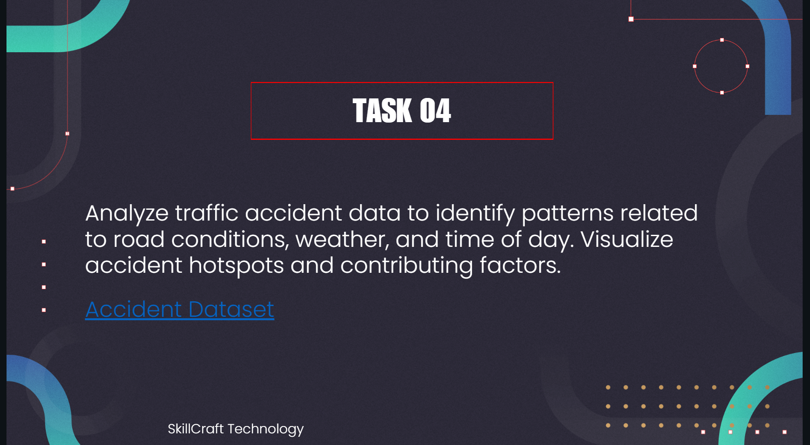

# Analyze Traffic Accident Data (Task 4)  

**Task ID:** SKILLCRAFT_DS_04  
**Organization:** SkillCraft Technology  

## 📊 Project Overview
This project analyzes **Road Traffic Accident (RTA) data** to identify patterns related to **road conditions, weather, and time of day**. The goal is to visualize accident hotspots and understand key contributing factors.

## 🛠️ Tools & Technologies
- Python  
- Pandas  
- NumPy  
- Matplotlib  
- Seaborn  
- Jupyter Notebook  
- Scikit-learn (KNN for predictive analysis)  

## 📂 Dataset
The dataset contains traffic accident records including:  
- Accident severity (Fatal, Serious, Slight)  
- Road conditions  
- Weather conditions  
- Time of accident  

## 🔍 Exploratory Data Analysis
- Visualization of accident hotspots  
- Analysis of trends based on road type, weather, and time of day  
- Identification of patterns contributing to accident severity  

## 🧠 Predictive Modeling (KNN)
The **K-Nearest Neighbors (KNN)** algorithm was used to predict accident severity.  

### Performance Metrics
| Class            | Precision | Recall | F1-score | Support |
|-----------------|-----------|--------|----------|---------|
| Fatal injury     | 0.80      | 1.00   | 0.89     | 3126    |
| Serious Injury   | 0.64      | 0.91   | 0.75     | 3144    |
| Slight Injury    | 0.97      | 0.31   | 0.47     | 3104    |

**Overall Accuracy:** 0.74  

**Average Metrics:**  
- Macro Average: Precision 0.80, Recall 0.74, F1-score 0.71  
- Weighted Average: Precision 0.80, Recall 0.74, F1-score 0.71  

## 📈 Insights
- KNN predicts **Fatal injuries** very well (high recall) but struggles with **Slight injuries**.  
- Accident patterns vary significantly with weather and road conditions.  
- Visualizations highlight **hotspots for severe accidents**, which can inform preventive measures.  

## 🔗 GitHub Repository 

## 📌 Hashtags
#SkillCraftTechnology #DataScience #Internship #CareerDevelopment #LearningJourney
